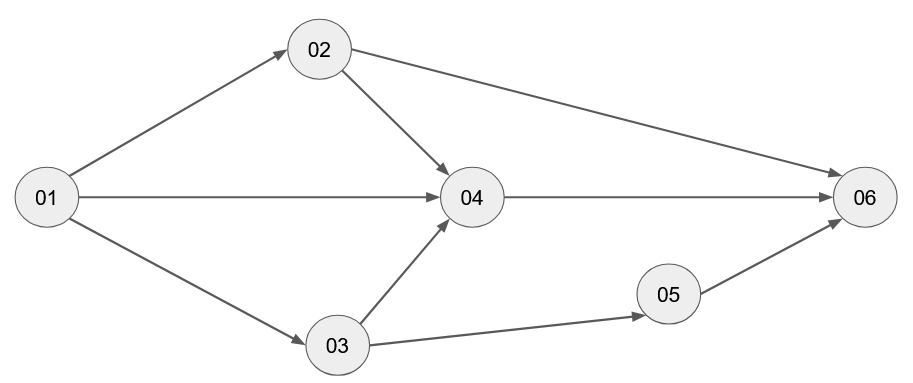

# paginas_PERT
[DIGITALIZAÇÃO][LIVRO] Uma introdução programada ao PERT : avaliação de programa e técnica de revisão

https://developer.mozilla.org/en-US/docs/Web/MathML/Element/msub

```
(<math>
    <msub>
        <mi>T</mi>
        <mn>L</mn>
    </msub>
</math>).

(<math>
    <msub>
        <mi>T</mi>
        <mn>e</mn>
    </msub>
</math>).

(<math>
    <msub>
        <mi>t</mi>
        <mn>e</mn>
    </msub>
</math>).
```


https://imasters.com.br/desenvolvimento/bash-for-loop-primeiro-passo-na-automacao-no-linux
```
{
    for counter in $(seq 3 9); do cat 002.html > "00${counter}.html"; done
    for counter in $(seq 10 99); do cat 002.html > "0${counter}.html"; done
    for counter in $(seq 100 148); do cat 002.html > "${counter}.html"; done
}
```

```
for ($i = 2; $i <= 148;$i++) {
	$valor = str_pad($i, 3, 0, STR_PAD_LEFT);
    $aux = $valor;
    $min = $aux - 1;
    $max = $aux + 1;
	echo "sed -i 's/001.html/" . str_pad($min, 3, 0, STR_PAD_LEFT) .".html/' {$valor}.html<br>";
	echo "sed -i 's/002.html/" . str_pad($max, 3, 0, STR_PAD_LEFT) .".html/' {$valor}.html<br>";
    echo "sed -i 's/qwerty/{$i}/' {$valor}.html<br>";
    echo "<br>";
}
?>
```

55 imagens




<div>
    <ol type="a">
        <li>Sim ................................................ <a href="002.html"><i>Veja página 2</i></a></li>
        <li>Não ............................................... <a href="003.html"><i>Veja página 3</i></a></li>
        <li>Eu Não sei .................................. <a href="004.html"><i>Veja página 4</i></a></li>
    </ol>
</div>